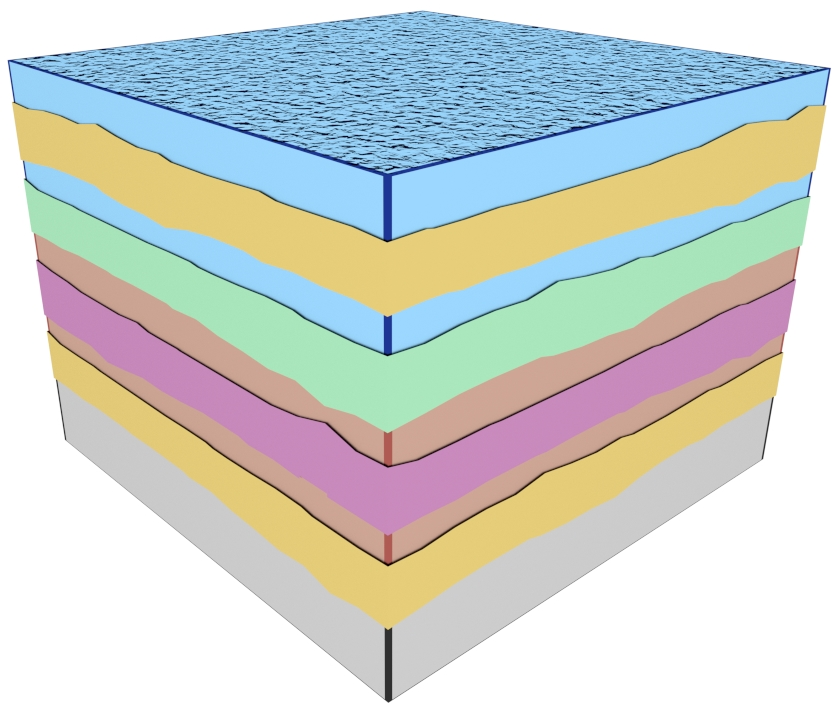
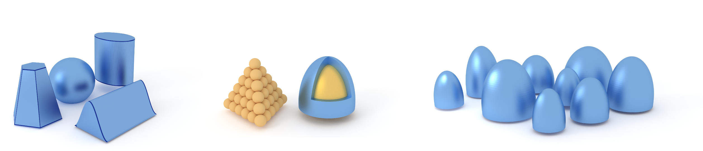
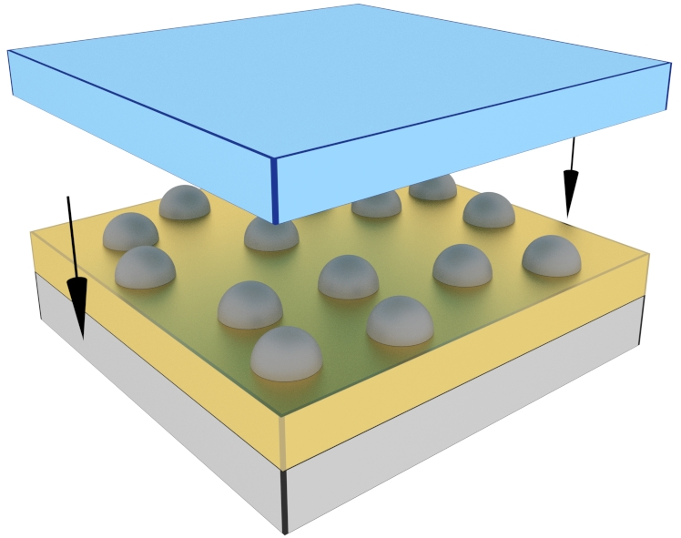
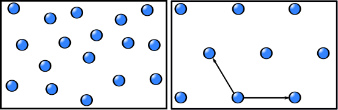
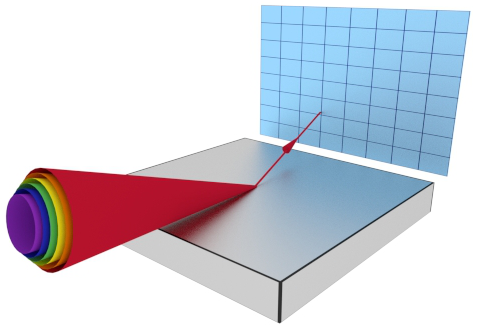

Functionality overview
=============================
BornAgain enables the simulation and fitting of the scattering from different geometries of samples. Below is a list of the building blocks and their features, which are available in BornAgain.

Layers
----------------------------------------------------

* Support multilayers without any restrictions on the number of layers
* Interface roughness correlation
* Magnetic materials

   *Multilayered structure with roughness*

Particles
----------------------------------------------------

* Choice between different shapes of nanoparticles (form factors)
* Particles with inner structures
* Assemblies of particles
* Size distribution of the particles (polydispersity)

     *Selection of shapes available in BornAgain:*

     *elementary shapes, combination of particles, core-shell particles, and polydisperse distribution.*

Positions of particles
----------------------------------------------------
* Decoupled implementations between vertical and planar positions
* Vertical distributions:

   *Deposited or embedded layers of particles*
   
   

* Planar distributions:

    * Disordered systems
    * Short-range order distribution (paracrystals)
    * 2D lattices

   *Examples of planar distribution of particles: disordered and lattice*
   
   

* Fine tuning by rotating and / or translating the particles

Input beam
----------------------------------------------------
* Polarized or unpolarized neutrons
* X-ray
* Divergence of the input beam (wavelength, incident angles...)
  following different distributions
* Possible normalization of the input intensity

   
   *Input beam with wavelength divergence*

Detector
----------------------------------------------------
* Off specular scattering
* 2D intensity matrix, function of the output angles

Use of BornAgain
----------------------------------------------------
* Simulation of GISAXS and GISANS from the generated sample
* Fitting to reference data (experimental or numerical)
* Interactions via 

    * Python scripting

    see :ref:`working_from_python_label`
    
    * Graphical User Interface

    see :ref:`using_gui_label`
