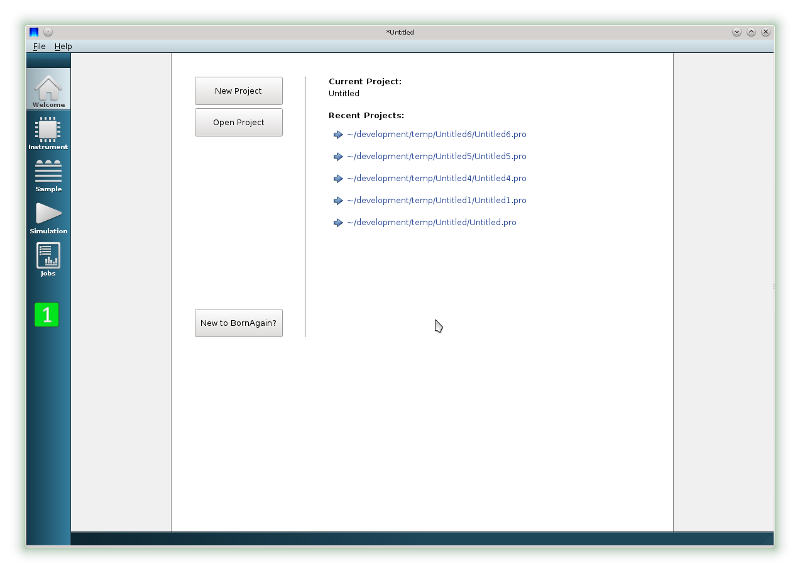
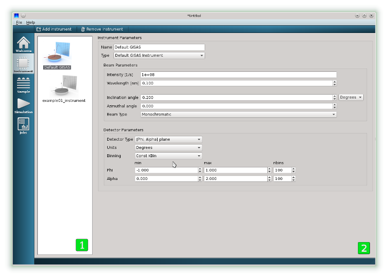
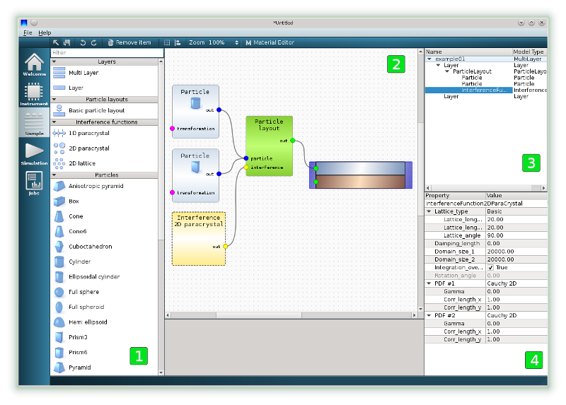
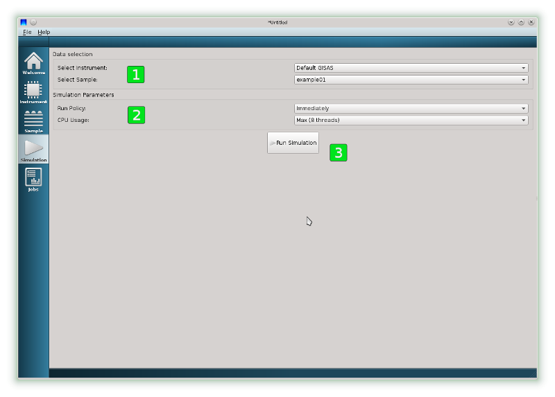
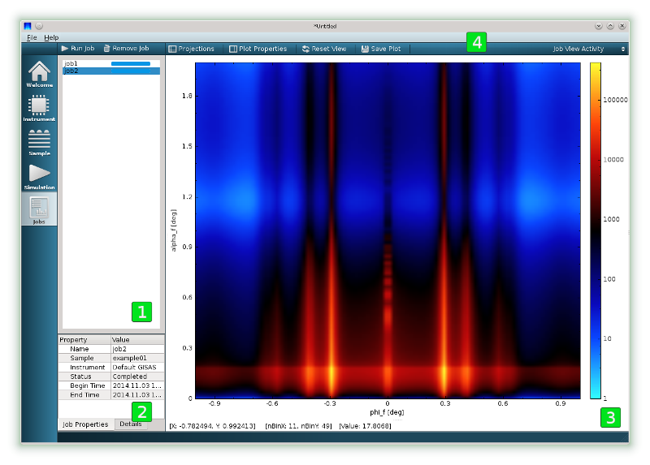
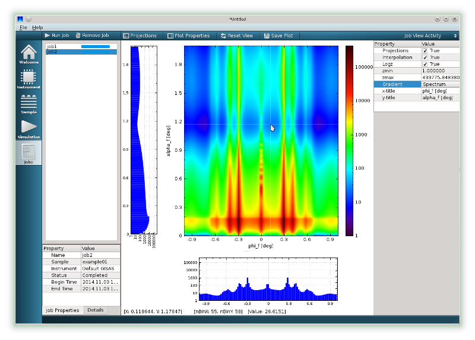
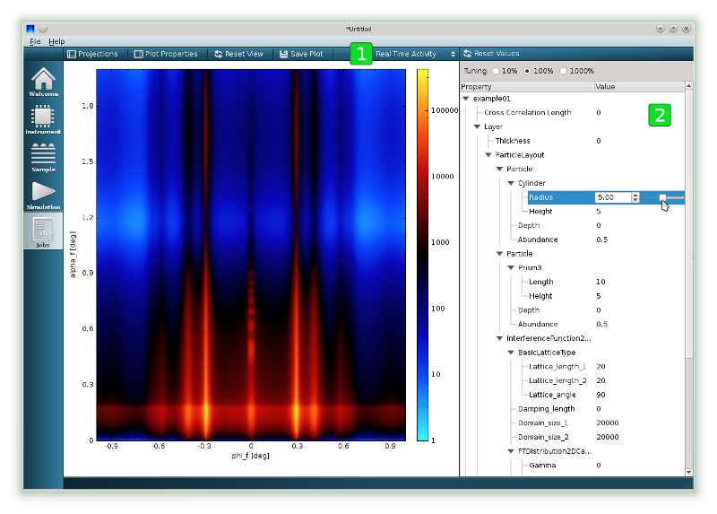

Using Graphical User Interface
=================================

The current beta version of BornAgain GUI allows to the user
to create basic multi-layer samples, populate it with particles, run 
scattering simulation and save results in the publication ready form.

Following video tutorial  will present users with a guide on using BornAgain graphical user interface

.. raw:: html

        <object width="480" height="385"><param name="movie"
        value="http://www.youtube.com/v/SBqYZ3KdAUc&hl=en_US&fs=1&rel=0"></param><param
        name="allowFullScreen" value="true"></param><param
        name="allowscriptaccess" value="always"></param><embed
        src="http://www.youtube.com/v/SBqYZ3KdAUc&hl=en_US&fs=1&rel=0"
        type="application/x-shockwave-flash" allowscriptaccess="always"
        allowfullscreen="true" width="480"
        height="385"></embed></object>
        

Basic features of interface are explained below.
        
Welcome view
-------------------

When you start BornAgain, it opens in Welcome view, where you can

* Create new projects
* Open recent projects

    

You can use view selector located on the left vertical panel (1) to change to another view:

* |InstrumentIcon| Instrument view is used to change setting of scattering instrument
* |SampleIcon| Sample view is used to construct samples
* |SimulationIcon| Simulation view is used to run the simulation
* |JobsIcon| Jobs mode represents results of the simulation    

.. |InstrumentIcon| image:: ../../_static/icon_instrument.png
          :align: bottom

.. |SampleIcon| image:: ../../_static/icon_sample.png
          :align: bottom

.. |SimulationIcon| image:: ../../_static/icon_simulation.png
          :align: bottom

.. |JobsIcon| image:: ../../_static/icon_jobs.png
          :align: bottom
          
          
Instrument view
-------------------

Instrument view is used to create new scattering instruments and adjust they setting. The view consist from instrument selector located on the left (1)
and instrument settings window located on the right (2).

On instrument setting window (2) you can adjust settings of currently selected instrument:

* The name of the Instrument
* Beam parameters
* Detector parameters
   

Sample view
-------------------

Sample view allows you to visually design the sample in a drag-and-drop interface. There are four main parts in this view

* Item toolbox (1) contains a variety of items to build scattering sample
* Sample canvas (2) is used to put sample items together
* Sample tree view (3) represent hierarchy of objects composing the sample
* Property editor (4) can be used to edit parameters of currently selected ittem

User constructs the sample by dragging items from item toolbox (1), dropping them on sample canvas (2), connecting items of appropriate types together and adjusting they properties, 
if necessary, using property editor (4). 

.. note::

    The sample represented on this plot was constructed via following
    sequence of actions:

    * Multilayer item was taken from item toolbox and placed on sample canvas
    * Two layer items were taken from item toolbox and placed on top of multi layer
  
      * Materials of top and buttom layers were changed from default one with the help of property editor

    * ParticleLayout item was taken from item toolbox, placed on sample canvas and connected with the top layer

    * Cylinders and prisms were dropped on sample canvas and connected with ParticleLayout

      * Materials of particles were changed from default one with the help of property editor

    * Interference function representing 2D paracrystal was placed on sample canvas and connected with ParticleLayout

.. note::
    User can have as many objects on sample canvas as he likes. But only multi-layers (with at least one layer inside) will be available
    for consequent simulation.
    

Simulation view
-------------------

Simulation view contains three important elements

* Group box for selecting instrument and sample to simulate (1)
* Group box for changing main simulation parameters (2)
* Run simulation button (3)

If user has constructed already one instrument and one sample, they names will be displayed in group box (1).
In the case of multiple samples and multiple instruments defined, the user can select desired combination to run the simulation.

Simulation starts as soon as Run Simulation button (3) is pressed. As soon as simulation is completed, the current view will be automatically switched to the Jobs View to present simulation results.
Given behaviour can be changed by changing run policy in (2).

Jobs view
-------------------

Jobs view displays results of the simulation. It has two different presentations called

.. contents::
   :depth: 1
   :local:
   :backlinks: none
   
Job View Activity is always shown by default.

Job View Activity
""""""""""""""""""""""""""""

The layout of Job View Activity consists of 3 elements

* Jobs selector widget (1) for selecting specific job to look at
* Job properties widget (2) contains basic information about currently selected job
* Intensity data widget (3) shows intensity data of currently selected job.

On current image two completed jobs can be seen in job selector widget (1), with job2 currently selected and shown. 

.. note::

    Intensity image in widget (3) allows certain level of interaction:

    * Using mouse wheel user can zoom an image in and out
    * By dragging color palette on the right of the image min, max range of z-axis can be changed
    * Tool bar (4) on top of Jobs view gives access to more options via Plot Properties and Projections buttons
   

   
Image represents results of same job2 with Projections and Plot Properties widgets switched On. The type of gradient is changed from default Polar to Spectrum.

Real Time Activity
""""""""""""""""""""""""""""

The second layout of Job View is called Real Time Activity. It can be switched on by selecting appropriate item in combo box located in the right corner of tool bar (1) of Intensity Data widget.

In this case, the layout of Job View consist of same Intensity Data widget on the left, and additional parameter tree located on the right (2).
Job selector and job properties widgets remain hidden.

The parameter tree represents all parameters which have been used during the construction of scattering instrument and the sample. User can click on
parameter of his choise and adjust its value using the slider. The simulation will run in the background and IntensityData widget will be constantly updating
reflecting the influence of given parameter on simulation results.

.. note::

    * This functionality works smoothly only for simple geometries, when the simulation requires fraction of seconds to run.
      For complex geometries demanding lots of CPU, the user will mostly see the progress bar and movements of the slider will not have any influence on Intensity Data widget.

    * In this case user may want to try to speed up his simulation by decreasing number of detector channels in Instrument View.

   

   