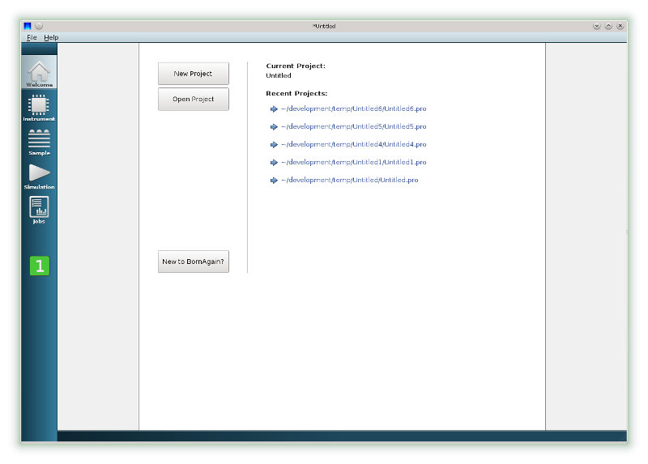
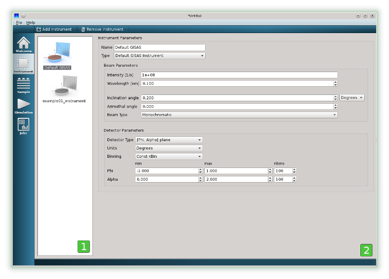
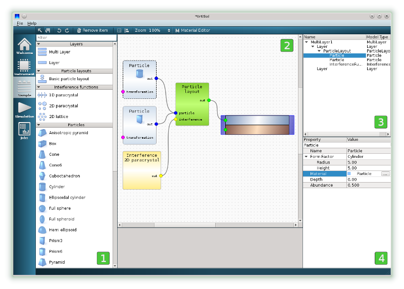
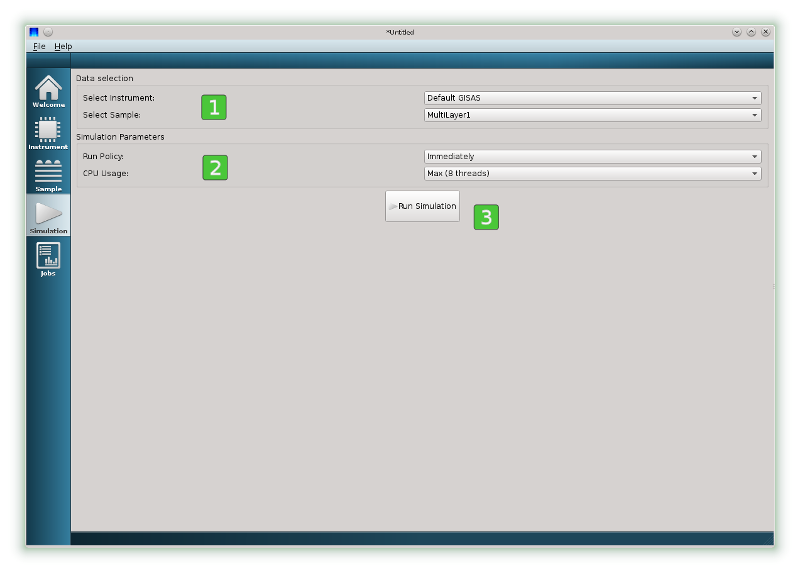
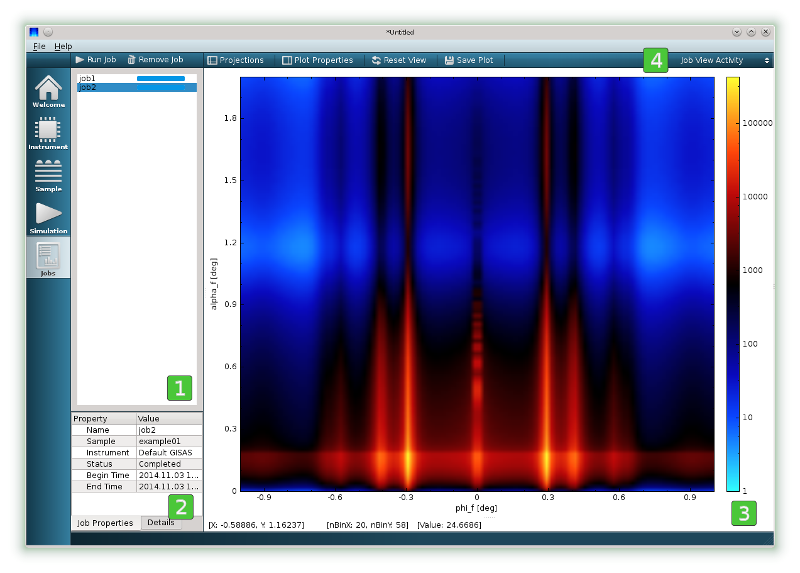
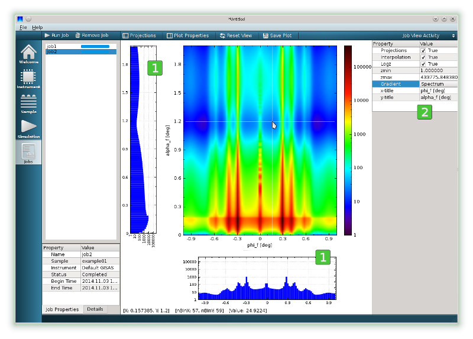
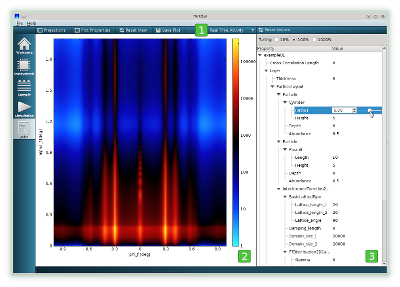

.. _using_gui_overview_label: 

BornAGain GUI Overview
============================

The basic features of interface are explained below.
        
Welcome view
-------------------

When you start BornAgain GUI, you will be presented with the Welcome View, where you can

* Create new projects
* Open recent projects

    

You can use the view selector located on the left vertical panel (1) to change to one of the following views :

* |InstrumentIcon| The :ref:`instrument_view_label` is used to change the settings of the scattering instrument 
* |SampleIcon| The :ref:`sample_view_label` is used to construct the samples
* |SimulationIcon| The :ref:`simulation_view_label` is used to run the simulation
* |JobsIcon| The :ref:`jobs_view_label` represents the results of the simulation    

.. |JobsIcon| image:: ../../_static/icon_jobs.png
          :align: bottom
          

          
          
.. _instrument_view_label:  

Instrument View
-------------------

The Instrument View is used to create new scattering instruments and adjust their settings. The view consists in the instrument selector located on the left (1)
and the instrument settings window located on the right (2).

On the instrument settings window (2) you can modify the settings of the currently selected instrument:

* The name of the instrument
* The beam parameters
* The detector parameters
   

   
.. _sample_view_label:  
   
Sample View
-------------------

The Sample View allows you to design the sample via a drag-and-drop interface. It consists in a 4 main parts

* The item toolbox (1) contains a variety of items to build the sample
* The sample canvas (2) is used to assemble the sample
* The sample tree view (3) represents the hierarchy of the objects composing the sample
* The property editor (4) can be used to edit the parameters of the currently selected item

The sample constructed in this figure comprises a substrate on which are deposited, in equal proportion, cylinders and prisms. The interference between scattered waves is provided
via two-dimensional paracrystal interference function.   

The sample is constructed by dragging items from the item toolbox (1), dropping them on the sample canvas (2), connecting the items of the appropriate types together and adjusting their properties, 
if necessary, using the property editor (4). 

In given figure, the property editor shows the parameters of currently selected cylindrical particles (radius and height of cylinders, their material, particles depth and abundance).

.. note::

    The sample shown on this plot was constructed using the following steps:

    * The multilayer item was taken from the item toolbox and placed on the sample canvas
    * Two layer items were taken from the item toolbox and placed on top of the multilayer
  
      * The materials of the top and buttom layers were changed from the default one using the property editor

    * ParticleLayout item was taken from item toolbox, placed on sample canvas and connected with the top layer

    * Cylinders and prisms were dropped on the sample canvas and connected with the ParticleLayout

      * The materials of particles were changed from the default one using the property editor

    * The interference function representing a 2D paracrystal was placed on the sample canvas and connected with the ParticleLayout item

.. note::
    * The sample canvas can have any number of multilayers. If this is the case, during the configuration of the simulation user will have to choose which multilayer to simulate.
    * The multilayer is considered as valid for the simulation, if it contains at least one layer
    
    
    

..    User can have as many objects on sample canvas as he likes. But only multi-layers (with at least one layer inside) will be available for consequent simulation.
    
    
    
.. _simulation_view_label:  

Simulation View
-------------------

The Simulation View contains three important elements

* The data selection box for selecting the instrument and the sample to simulate (1)
* Simulation Parameters box for changing main simulation parameters (2)
* The Run Simulation button (3)

The names of the defined instruments and samples are displayed in Data Selection box (1). From where the user can select a combination to run the simulation.

Clicking on the Run Simulation button (3) immideately starts the simulation. When completed, the current view is automatically switched to the Jobs View showing the simulation results.
This behaviour can be modified by changing Run Policy in (2).

.. _jobs_view_label:  

Jobs View
-------------------

The Jobs View displays results of the simulation. It has two different presentations called

.. contents::
   :depth: 1
   :local:
   :backlinks: none
   
Job View Activity is shown by default.

Job View Activity
""""""""""""""""""""""""""""

The layout of the Job View Activity consists of three elements

* The jobs selector widget (1) for selecting the specific job to be displayed
* The job properties widget (2) contains basic information about the currently selected job
* The intensity data widget (3) shows the intensity data of the currently selected job

The toolbar (4) contains set of control elements for job selector and intensity data widgets. The right corner of toolbar is occupied by the Jobs Activity selector.

The two completed jobs can be seen in the job selector widget (1), with job2 currently selected and dislayed. 

.. note::

    The intensity image in widget (3) offers several ways of interaction:

    * Using the mouse wheel to zoom in and out
    * Dragging the color palette on the right of the image to change the min, max range of z-axis
    * The toolbar (4) on top of intensity data widget gives access to more options via Plot Properties and Projections buttons
   

   
The image represents the results of job2 with the Projections (1) and Plot Properties (2) widgets switched On. The type of colorbar gradient is changed from the default Polar to Spectrum.

Real Time Activity
""""""""""""""""""""""""""""

The second layout of Job View is called the Real Time Activity. It can be switched on by selecting the appropriate item in the box located in the right corner of tool bar (1).

The layout of Job View consist of Intensity Data widget on the left (2), and additional parameter tree located on the right (3).

The parameter tree represents all parameters which have been used during the construction of scattering instrument and the sample. 
Each displayed parameter value can be adjusted using the slider.
The simulation will run in the background and the Intensity Data widget will be constantly updated
reflecting the influence of this given parameter on the simulation results.

.. note::

    Real Time View works smoothly only for simple geometries, when the simulation requires fractions of a second to run.
    For more complex geometries, demanding lots of CPU, the user will see a progress bar and any movements of the slider will not have any influence on the Intensity Data widget.
    In this case the user may try to speed up the simulation by decreasing the number of detector channels in the Instrument View and submitting new job by running the simulation from Simulation View.

.. important::

    The jobs in Jobs View are completely isolated from the rest of the program. Any adjustments of sample parameters in Sample View or 
    instrument parameters in Instrument View 
    won't have any influence on jobs already completed or still running in Jobs View. Similarly, any parameter adjustments made in the parameter tree (3)
    will not be propagated back into Sample or Instrument Views.
   

   
   