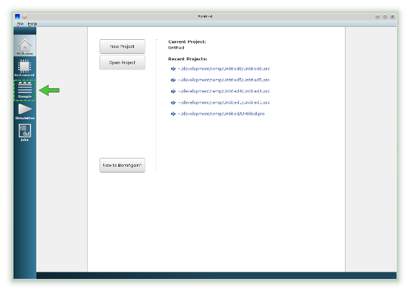
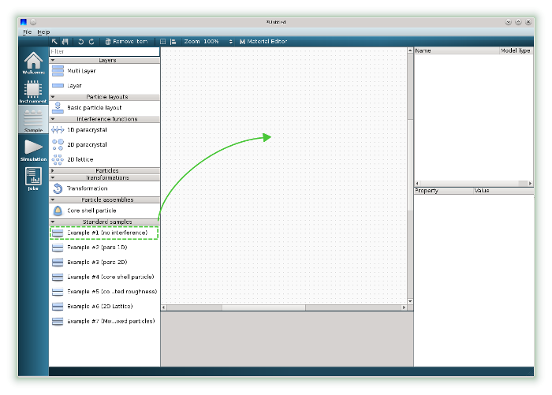
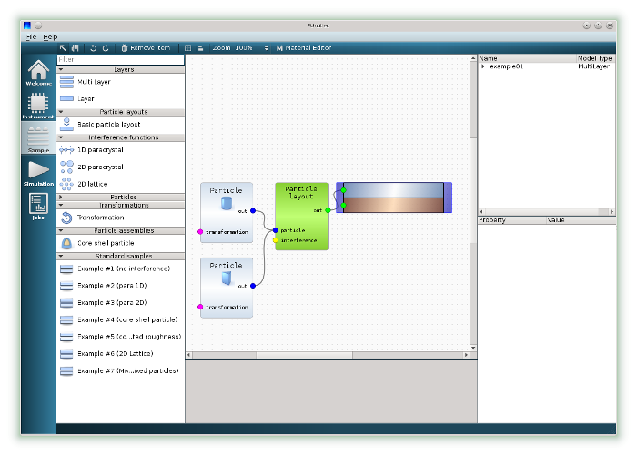
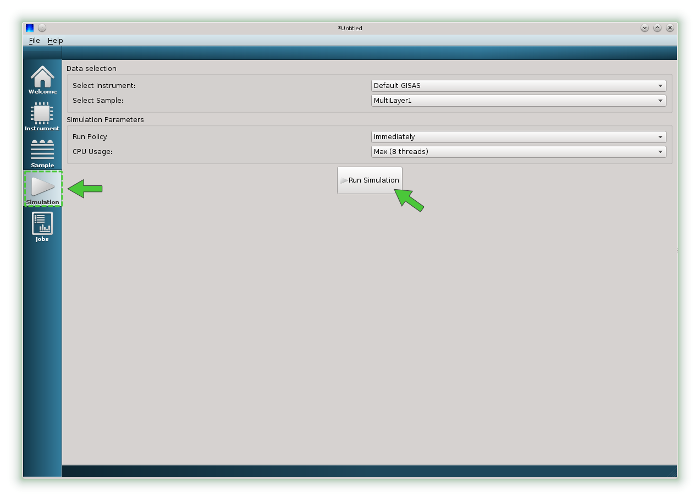

.. _using_gui_quickstart_label: 

Quick Start
===================================

This tutorial demonstrates how to run the simulation and get simulated intensity data image in a few mouse clicks.

**1. Run BornAgain Graphical User Interface**

Use BornAgain icon |BornAgainIcon| located on the desktop (Windows) or look for it on Launchpad (MacOS) to start GUI.

.. |BornAgainIcon| image:: ../../_static/bornagainapp_32.png
          :align: top

For Linux users run an executable located in BornAgain installation directory from command line

.. code-block:: bash

  $ <install_dir>/bin/BornAgain

  
**2. Switch to the Sample View**

Switch to the Sample View by clicking on the pictogram marked on the left panel.

**3. Construct the sample**

Drag predefined standard sample with the name Example#1  from item toolbox and drop it on canvas.

You will get a sample representing a multilayer with two types of particles on top of substrate   
   
**4. Run the simulation**

Switch to the Simulation View and press Run Simulation button.

.. image:: ../../_static/gui_quickstart3b_700.png
   :align: center
   :target: ../../_static/gui_quickstart3b.png

When simulation is completed, the current view will be automatically switched to the Jobs View showing the intensity data results.
